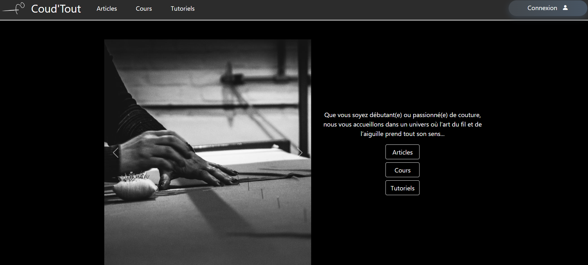

# Coud'Tout – Site fictif

## Description  
Site fictif développé avec une orientation back-end.  
Le site est centré sur le thème de la couture, avec 4 types d’utilisateurs : **administrateur**, **professionnel**, **membre**, et **visiteur**.  
Un système de forum est intégré, avec gestion des contenus selon les rôles.

Fonctionnalités principales :  
- Ajout / modification / suppression d’articles  
- Commentaires  
- Connexion / inscription avec gestion des rôles  
- Réservations et consultation des réservations  
- Interface de gestion selon le type de compte

## Technologies et outils utilisés
  
  
  
  
  
  

## Démonstration vidéo  
[Voir la vidéo de démonstration](URL_DE_LA_VIDEO)

## Version Symfony – Voir le site  
[Accéder au site](https://coudtout.gruber.etu.mmi-unistra.fr/)

> Connexion possible avec des **fixtures** :  
- **admin**  
- **pro**  
- **user**
